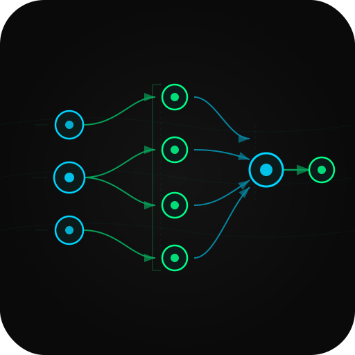

<div align="center">
  
  <h1>synapse</h1>
  <p><strong>Parallel tool execution for AI agents. Auto-detect dependencies, maximize speed.</strong></p>

  [](https://github.com/speed785/synapse-orchestrator/actions/workflows/ci.yml)
  [](https://github.com/speed785/synapse-orchestrator)
  [](https://pypi.org/project/synapse-orchestrator/)
  [](https://www.npmjs.com/package/synapse-orchestrator)
  [](https://python.org)
  [](https://typescriptlang.org)
  [](LICENSE)

  [Quick Start](#quick-start) · [How It Works](#how-it-works) · [Integrations](#integrations) · [API Reference](#api-reference)
</div>

---

## Why synapse?

Your agent fires four tool calls. Your code runs them one at a time. Two of them don't depend on each other at all — they're just waiting in line.

```
# Without synapse — sequential, wasteful
fetch_user    → 150 ms
fetch_catalog → 150 ms   ← no reason to wait
build_cart    → 100 ms
send_receipt  →  50 ms
─────────────────────────
Total         → 450 ms
```

Synapse reads the `$results.*` references in your tool inputs, builds a dependency graph, and fires independent calls in parallel. No changes to your agent logic.

```
# With synapse — parallel where possible
fetch_user ─┐
            ├── 150 ms ──► build_cart → send_receipt
fetch_catalog ─┘
──────────────────────────────────────────────────────
Total: 310 ms   →   1.45x faster on this pipeline
       355 ms   →   3.24x faster on 5-way fan-out
       460 ms   →   4.89x faster on 10-way fan-out
```

Zero new dependencies. Pure stdlib asyncio. Drop it in, get the speedup.

---

## How It Works

Synapse scans your tool call inputs for `$results.<id>` placeholders. Each reference is an edge in a dependency DAG. Calls with no incoming edges run immediately, in parallel. When they finish, their results are injected into the next stage.

```
Your tool calls:

  fetch_wikipedia ─┐
  fetch_arxiv     ─┤
  fetch_github    ─┼──► aggregate ──► format_report
  fetch_news      ─┤
  fetch_patents   ─┘

Synapse execution plan:

  Stage 0  [parallel]   fetch_wikipedia, fetch_arxiv, fetch_github,
                        fetch_news, fetch_patents          → 200 ms
  Stage 1  [serial]     aggregate                          → 100 ms
  Stage 2  [serial]     format_report                      →  50 ms
                                                    ─────────────────
                                         Wall clock:        350 ms
                                         Sequential would:  1150 ms
                                         Speedup:           3.3x
```

The planner is a simple BFS topological sort. No magic, no runtime overhead worth measuring (~5 ms on cold start).

---

## Features

- **Auto dependency detection** via `$results.<id>` and `$results.<id>.<path>` placeholders
- **Explicit ordering** with `depends_on` for semantic dependencies (no data flow needed)
- **Nested path resolution** — `$results.user.email` extracts deeply nested values automatically
- **Error propagation** — a failed call marks all downstream calls as skipped, not crashed
- **Per-call retries and timeouts** on every `ToolCall`
- **Execution reports** with wall-clock time, per-call durations, and speedup estimate
- **Observability** via `SynapseLogger` with Prometheus export and OpenTelemetry hooks
- **OpenAI, Anthropic, LangChain, LlamaIndex, CrewAI** integrations — drop-in wrappers, no agent rewrite
- **Python + TypeScript** implementations, same API surface
- **100% test coverage**

---

## Quick Start

### Python

```bash
pip install synapse-orchestrator

# With LLM provider extras:
pip install synapse-orchestrator[openai]
pip install synapse-orchestrator[anthropic]
pip install synapse-orchestrator[langchain]
pip install synapse-orchestrator[llamaindex]
pip install synapse-orchestrator[crewai]
```

**Before synapse** — four awaits, one at a time:

```python
user    = await fetch_user(42)
catalog = await fetch_catalog("widgets")
cart    = await build_cart(user, catalog)
receipt = await send_receipt(cart, user["email"])
# ~450 ms
```

**After synapse** — same logic, parallel execution:

```python
import asyncio
from synapse import Orchestrator, ToolCall

orch = Orchestrator(tools={
    "fetch_user":    fetch_user,
    "fetch_catalog": fetch_catalog,
    "build_cart":    build_cart,
    "send_receipt":  send_receipt,
})

report = await orch.run([
    ToolCall(id="user",    name="fetch_user",    inputs={"user_id": 42}),
    ToolCall(id="catalog", name="fetch_catalog", inputs={"category": "widgets"}),
    ToolCall(id="cart",    name="build_cart",
             inputs={"user": "$results.user", "catalog": "$results.catalog"}),
    ToolCall(id="receipt", name="send_receipt",
             inputs={"cart": "$results.cart", "email": "$results.user.email"}),
])

print(report)
# ── Synapse Execution Report ──────────────────────────
#   Wall clock : 312 ms
#   Stages     : 3
#   Parallel   : 2 calls
#   Sequential : 2 calls
#   Speedup    : 1.46x
#   Results:
#     ✓ [user]    fetch_user    — success in 151 ms
#     ✓ [catalog] fetch_catalog — success in 149 ms
#     ✓ [cart]    build_cart    — success in 102 ms
#     ✓ [receipt] send_receipt  — success in  51 ms
# ─────────────────────────────────────────────────────
```

`fetch_user` and `fetch_catalog` have no `$results.*` references, so synapse runs them together. `build_cart` references both, so it waits. `send_receipt` references `build_cart`, so it goes last. You wrote the dependency graph by writing normal code.

### TypeScript / Node.js

```bash
npm install synapse-orchestrator
```

```typescript
import { Orchestrator, ToolCall } from "synapse-orchestrator";

const orch = new Orchestrator({
  tools: {
    fetchUser:    fetchUserFn,
    fetchCatalog: fetchCatalogFn,
    buildCart:    buildCartFn,
    sendReceipt:  sendReceiptFn,
  },
});

const report = await orch.run([
  { id: "user",    name: "fetchUser",    inputs: { userId: 42 } },
  { id: "catalog", name: "fetchCatalog", inputs: { category: "widgets" } },
  { id: "cart",    name: "buildCart",
    inputs: { user: "$results.user", catalog: "$results.catalog" } },
  { id: "receipt", name: "sendReceipt",
    inputs: { cart: "$results.cart", email: "$results.user.email" } },
]);

console.log(`Speedup: ${report.speedupEstimate.toFixed(2)}x`);
```

---

## Usage

### Dependency detection

**Implicit** — any `$results.<id>` string in `inputs` creates a dependency edge and gets resolved before the call runs:

```python
ToolCall(
    id="summary",
    name="summarize",
    inputs={
        "text":   "$results.fetch_doc",        # depends on fetch_doc
        "author": "$results.fetch_user.name",  # nested path, auto-resolved
    }
)
```

**Explicit** — use `depends_on` when ordering matters but no data flows between calls:

```python
ToolCall(
    id="notify",
    name="send_notification",
    depends_on=["write_db", "invalidate_cache"],  # runs after both, no data needed
    inputs={"message": "Done!"},
)
```

### Retries and timeouts

```python
ToolCall(
    id="flaky_api",
    name="call_external_service",
    inputs={"query": "..."},
    retries=3,       # retry up to 3 times on exception
    timeout=5.0,     # cancel after 5 seconds
)
```

### Inspect the plan before running

```python
plan = orch.plan(calls)
print(plan)
# Stage 0 (parallel): fetch_wikipedia, fetch_arxiv, fetch_github, fetch_news, fetch_patents
# Stage 1 (serial):   aggregate
# Stage 2 (serial):   format_report
```

### Observability

```python
from synapse import Orchestrator, SynapseLogger

logger = SynapseLogger(emit_json=True)
orch = Orchestrator(tools={...}, logger=logger, debug=True)

report = await orch.run(calls)
print(logger.export_prometheus())
# synapse_call_duration_ms{tool="fetch_user"} 151.2
# synapse_call_duration_ms{tool="fetch_catalog"} 149.8
# synapse_speedup_ratio 1.46
```

---

## Integrations

### OpenAI

Drop-in replacement for your OpenAI client. Synapse intercepts tool call responses and parallelizes them transparently:

```python
from openai import AsyncOpenAI
from synapse.integrations.openai import SynapseOpenAI

client = SynapseOpenAI(
    openai_client=AsyncOpenAI(),
    tools={
        "get_weather":  get_weather,
        "get_forecast": get_forecast,
        "send_alert":   send_alert,
    },
)

response, reports = await client.chat(
    model="gpt-4o",
    messages=[{"role": "user", "content": "Weather and 5-day forecast for NYC and LA?"}],
    tools=openai_tool_schemas,
)
# NYC + LA fetched in parallel. Report shows 2x speedup.
```

### Anthropic

```python
import anthropic
from synapse.integrations.anthropic import SynapseAnthropic

client = SynapseAnthropic(
    anthropic_client=anthropic.AsyncAnthropic(),
    tools={
        "search_web":    search_web,
        "read_document": read_document,
        "summarize":     summarize,
    },
)

response, reports = await client.messages(
    model="claude-opus-4-5",
    max_tokens=4096,
    system="You are a research assistant.",
    messages=[{"role": "user", "content": "Research quantum computing and fusion energy."}],
    tools=anthropic_tool_schemas,
)
```

### LangChain

Wrap an existing `AgentExecutor` and call `arun_tool_batch` instead of running tools one at a time:

```python
from synapse.integrations.langchain import SynapseAgentExecutor

synapse_executor = SynapseAgentExecutor(agent_executor)

report = await synapse_executor.arun_tool_batch([
    {"id": "search", "name": "search_tool",   "inputs": {"query": "quantum computing"}},
    {"id": "wiki",   "name": "wikipedia_tool", "inputs": {"query": "fusion energy"}},
    {"id": "summary","name": "summarize_tool",
     "inputs": {"a": "$results.search", "b": "$results.wiki"}},
])
```

Synapse auto-adapts LangChain tools via `ainvoke`, `arun`, `invoke`, or `run` — whichever the tool supports.

### LlamaIndex

```python
from synapse.integrations.llamaindex import SynapseFunctionCallingAgent

synapse_agent = SynapseFunctionCallingAgent(function_calling_agent)

report = await synapse_agent.arun_tool_batch([
    {"id": "search", "name": "web_search", "inputs": {"query": "quantum computing"}},
    {"id": "papers", "name": "paper_lookup", "inputs": {"topic": "fusion energy"}},
    {"id": "merge", "name": "summarize", "inputs": {"a": "$results.search", "b": "$results.papers"}},
])
```

### CrewAI

```python
from synapse.integrations.crewai import SynapseCrewTaskExecutor

executor = SynapseCrewTaskExecutor(task_executors={
    "research": research_task,
    "draft": draft_task,
})

report = await executor.arun_tasks([
    {"id": "r1", "name": "research", "inputs": {"topic": "quantum networking"}},
    {"id": "r2", "name": "research", "inputs": {"topic": "fusion engineering"}},
    {"id": "d1", "name": "draft", "inputs": {"sources": "$results.r1"}, "depends_on": ["r1"]},
])
```

---

## Benchmarks

Measured on a MacBook Pro M3, simulated 150-200 ms I/O per call.

| Pipeline shape | Sequential | Synapse | Speedup |
|---|---|---|---|
| 2 independent → 1 → 1 | 450 ms | 310 ms | **1.45x** |
| 5-way fan-out → aggregate → format | 1150 ms | 355 ms | **3.24x** |
| 10-way fan-out → 2 reduce → 1 merge | 2250 ms | 460 ms | **4.89x** |
| Chain of 6 (no parallelism possible) | 900 ms | 905 ms | 1.00x |

Speedup scales with the width of your dependency graph. Purely sequential pipelines see no benefit — synapse adds ~5 ms overhead on cold start.

Run the examples yourself:

```bash
cd examples
python parallel_vs_sequential.py
python fan_out_fan_in.py
```

---

## API Reference

### `Orchestrator`

```python
Orchestrator(
    tools: dict[str, AsyncToolFn],
    on_call_start: Callable[[ToolCall], None] | None = None,
    on_call_end:   Callable[[CallResult], None] | None = None,
    logger:        SynapseLogger | None = None,
    debug:         bool = False,
)
```

| Method | Description |
|---|---|
| `analyze(calls)` | Build dependency graph without executing. Returns `DependencyGraph`. |
| `plan(calls)` | Build staged execution plan without executing. Returns `ExecutionPlan`. |
| `run(calls)` | Analyze, plan, execute. Returns `ExecutionReport`. |
| `run_raw(dicts)` | Same as `run` but accepts plain dicts instead of `ToolCall` objects. |

### `ToolCall`

| Field | Type | Description |
|---|---|---|
| `id` | `str` | Unique identifier within the plan. |
| `name` | `str` | Name of the registered tool function. |
| `inputs` | `dict` | Arguments passed to the tool. May contain `$results.*` refs. |
| `depends_on` | `list[str]` | Explicit dependency IDs (for ordering without data flow). |
| `timeout` | `float \| None` | Per-call timeout in seconds. |
| `retries` | `int` | Retry count on exception (default: 0). |

### `ExecutionReport`

| Field | Description |
|---|---|
| `results` | `dict[call_id, CallResult]` — per-call status, output, duration. |
| `total_duration_ms` | Wall-clock time for the entire run. |
| `stages_run` | Number of stages in the execution plan. |
| `parallel_calls` | Count of calls that ran concurrently with at least one other. |
| `speedup_estimate` | `sum(durations) / wall_clock` — values above 1.0 mean parallelism helped. |

### `CallResult`

| Field | Description |
|---|---|
| `call_id` | The `id` from the original `ToolCall`. |
| `tool_name` | The `name` from the original `ToolCall`. |
| `status` | `"success"`, `"error"`, or `"skipped"`. |
| `output` | Return value of the tool function (or `None` on error/skip). |
| `error` | Exception instance if `status == "error"`. |
| `duration_ms` | Time spent executing this call. |

---

## Project Structure

```
synapse-orchestrator/
├── python/
│   └── synapse/
│       ├── orchestrator.py         # Top-level entry point
│       ├── dependency_analyzer.py  # $results.* detection + explicit deps
│       ├── planner.py              # BFS topological sort → staged plan
│       ├── executor.py             # asyncio parallel runner, retries, timeouts
│       ├── observability.py        # SynapseLogger, Prometheus, OTel
│       └── integrations/
│           ├── openai.py           # OpenAI function-calling wrapper
│           ├── anthropic.py        # Anthropic tool-use wrapper
│           ├── langchain.py        # LangChain AgentExecutor adapter
│           ├── llamaindex.py       # LlamaIndex FunctionCallingAgent adapter
│           └── crewai.py           # CrewAI task executor adapter
│
├── typescript/
│   └── src/
│       ├── orchestrator.ts
│       ├── dependencyAnalyzer.ts
│       ├── planner.ts
│       ├── executor.ts             # Promise.all + Semaphore + retries
│       └── integrations/
│           ├── openai.ts
│           └── anthropic.ts
│
└── examples/
    ├── parallel_vs_sequential.py   # Basic 2+2 pipeline comparison
    ├── fan_out_fan_in.py           # 5-source research aggregation (3.3x)
    └── observability_example.py    # SynapseLogger + Prometheus export
```

---

## Contributing

1. Fork the repo.
2. Create a branch: `git checkout -b feat/your-feature`.
3. Add your changes and tests.
4. Submit a pull request.

New integrations (VertexAI, Bedrock...), visualization tools, async generator support, and streaming are all welcome.

---

## License

[MIT](LICENSE) — free for personal and commercial use.
